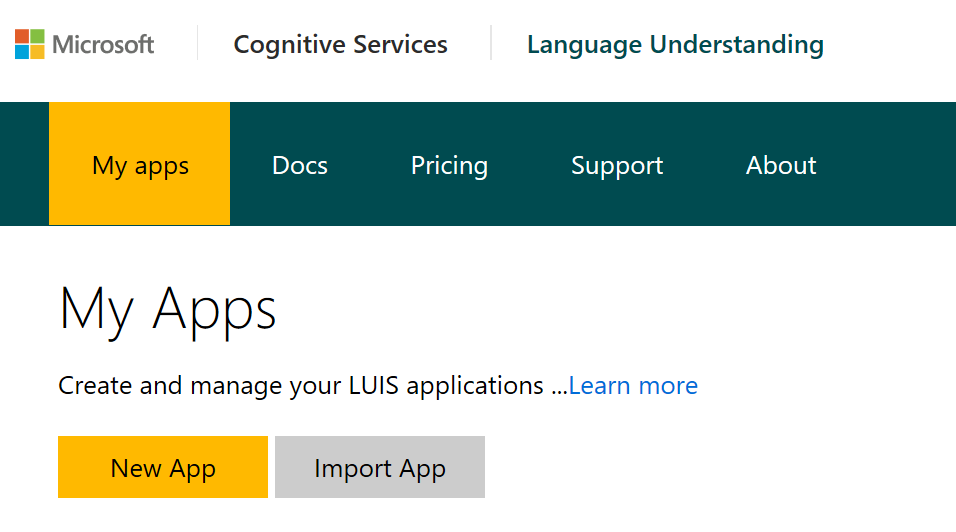

# LUIS Ramp-up
This document is to help readers ramp up quickly on Microsoft's Language Understanding Intelligent Service (LUIS). LUIS is part of the set of tools known as Microsoft Cognitive Services. It is an easy and effective way to inject natural language intelligence into conversational tools, such as bots and virtual assistants. It primarily serves two functions--to identify the primary intention of a an utterance and to identify the subjects or objects that the utterance contained.

## Prerequisites

- Access to an Azure Subscription
- Create a [Cognitive Services API Account](https://docs.microsoft.com/en-us/azure/cognitive-services/cognitive-services-apis-create-account)
- Optional: Create a paid [LUIS subscription key](https://docs.microsoft.com/en-us/azure/cognitive-services/LUIS/AzureIbizaSubscription)

## Application Set Up

- Create an application from the [LUIS](https://www.luis.ai/applications) site (or use the Programmatic APIs linked under "Resources" below)
  
  

## Core Concepts
- ### LUIS MODEL:
  - LUIS uses various machine learning techniques to analyze a string and decipher its meaning. A LUIS model can be trained by giving it examples that are labelled according to "intent" and "entities." At the end of training, a model can be published and deployed to an HTTPS endpoint for predictions.

- ### UTTERANCES:  
  An utterance is a string statement such as a user query or command. In LUIS, an utterance can be anywhere from 1 to 500 characters long, and can be comprised of characters, symbols, numerical values, etc. Multiple languages are also supported.

  Examples:  

  > "Yes" 

  > "What is this song? 

  > "Make a reservation for 4 at 8 p.m."

  > "+"

- ### INTENTS:  
  An intent is the desired action or goal expressed by an utterance. One of the outputs of a LUIS model is its prediction for the intent in an utterance, along with confidence scores for each intent defined in the application. Typically, the highest scoring intent is returned (though a verbose setting can also be used to return all intents).

  Examples:  

    Utterance | Intent |
    ------------ | :-----------: |
    *"Yes"*       | Confirm |
    *"What is this song?"* | GetSong |
    *"Make a reservation for 4 at 8 p.m."* | MakeReservation |
    *"+"* | None

- ### ENTITIES:
  Entities are subjects or objects that are within the utterance. Many times, they are as important, if not more important than the intents.

    - **Hierarchical entities**: Parent child relationship for entities. Only supports one depth, currently.  

      Example: 
      > A parent entity "Drink" has values "tea", "coffee", and "water".

    - **Composite entities**: Group of entity values that appear together. 

      Example:
      > A hotel booking has a room number, price, and date.

    - **Entity Lists**: Entity lists let you define a superset of all values for your entity. These are best used in scenarios where the entity is well-defined and not likely to change very often. Unlike features, an entity list is limiting and the entity will not be expanded during training to include other values.

- ### FEATURES:  
  Features are additional metadata that you can give to LUIS that assist in machine learning. These do not limit the model from inferring other related phrases or words.

    - **Phrase Lists**: Phrase lists are groups of similar words or phrases that serve a similar function (and can be treated as synonyms).  

      Example:  
      > "pc, laptop, computer"  

    - **Patterns**: These are regular function definitions that are used to guide the LUIS model in finding a phrase or word and relating that to either intents or entities.  

      Example:
      > "\w+ (v\.|v) \w+" might be a good regex to express court cases, such as "Miranda v. Arizona"

## Best Practices

### DO:
- Create multiple LUIS applications for different domains.
  - As a best practice, it's helpful to keep different domains (such as booking flights vs ordering food) in separate LUIS applications. If needed, a top-level LUIS application can help direct the query to the correct domain specific application. 

  Example:
  > "Tell me about J.P. Morgan Chase." (Intent: InfoCompany)  
  > "Tell me about Bill Gates." (Intent: InfoPerson)
  
  LUIS uses syntax to train its model, and does not rely on semantic meaning. So, grammatically similar samples will not differentiate well. The two utterances above are probably far too similar to train into two different intents for the same app. But, we can either create two different applications that are called by the bot after its asked the user whether or not it wants to talk about companies or people, or we can differentiate based on the entity and just create a common "GetInfo" intent.

- Use features to enhance results from LUIS.
  - Especially when the vocabulary for a domain is unique (such as with medical field), features such as phrase lists and patterns as well as entity lists, hierarchies, and compositions can help a model train more quickly.
- Train the 'None' category.
  - As mentioned in the LUIS FAQs, there should be approximately 1-2 'None' examples for every 10 regular labels. Make sure to use a variety of string lengths and sentence variations.
- Create versions of trained LUIS models, so that it is possible to compare performance between training sessions.
- Retrain the LUIS model on real user input.
- Pair LUIS with other cognitive APIs to enable spell-check or sentiment analysis.

### DON'T:
- Split similar utterances into multiple intents.
  - If too similar of utterances are used in multiple intents, LUIS will conflate these in future queries. Instead, try to group similar utterances into a single intent, and use entities and features to distinguish between the utterances.
- Rely on LUIS to know the context.
  - The scope of LUIS is the "utterance", so if further context is needed to understand a statement, then it should not be an intent. Instead, handle context as part of the dialog flow.

  Example: 
  > Bot: "Do you want a receipt for your transaction?"  
  > User: "Sure, I'd love one" (Response 1)  
  > Bot: "Do you want me to email the receipt?"  
  > User: "Yes, please do it" (Response 2)  

  In this example, Response 1 and Response 2 hold no context, but they both express a similar intent:
  > "Sure, I'd love one" (Response 1)  
  > "Yes, please do it" (Response 2)

  In this scenario, it would be best to create a general intent, such as confirm.

- Train LUIS based on obscure misspellings and grammatical mistakes.
  - While it may be helpful to train LUIS based on common misspellings/variances (such as "grammer" vs "grammar"), training LUIS to recognize all misspellings and variances can be tedious and involves labelling a representative set of utterances. Instead, consider using a spell-checker, such as the Bing Spell Check API, which can help with both misspelling and slang (A caveat is that if your application requires a lot of domain-specific vocabulary and abbreviations, a spellchecker may introduce incorrect autocorrected variations to train on).

## Add LUIS to Bot
- There are built-in commands that integrate LUIS with Microsoft Bot Framework. A repo of samples is currently in progress to show the different ways that LUIS can be called from within bot framework.

## Resources
- [Programmatic APIs](https://westus.dev.cognitive.microsoft.com/docs/services/5890b47c39e2bb17b84a55ff/operations/5890b47c39e2bb052c5b9c2f)
- [Version Control](https://docs.microsoft.com/en-us/azure/cognitive-services/LUIS/luis-how-to-manage-versions)
- [Text Analysis API](https://docs.microsoft.com/en-us/azure/cognitive-services/text-analytics/overview)

## Author(s)
- Xinyi Joffre